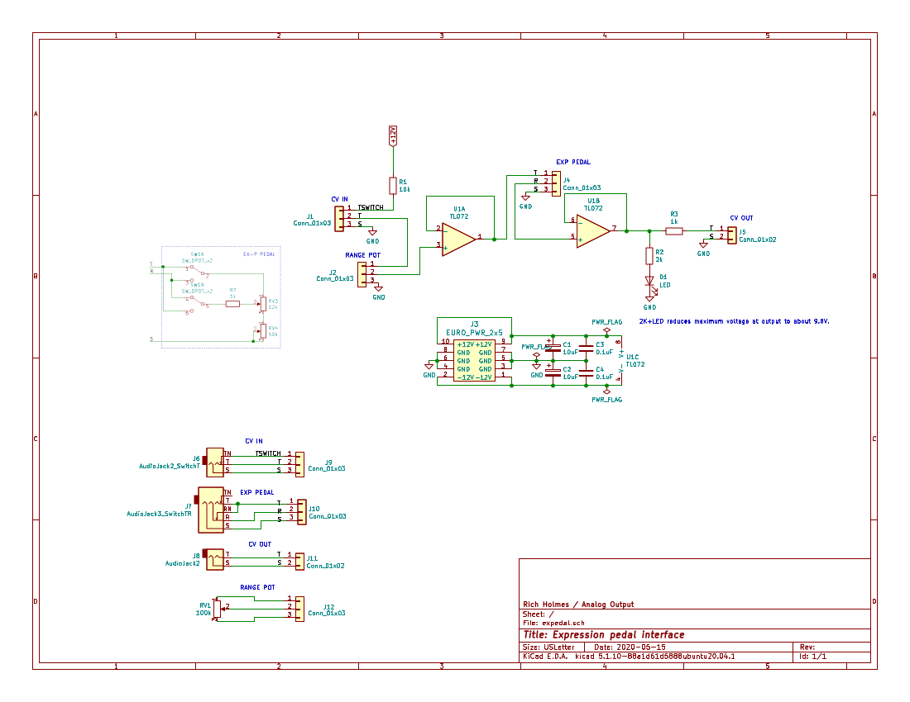
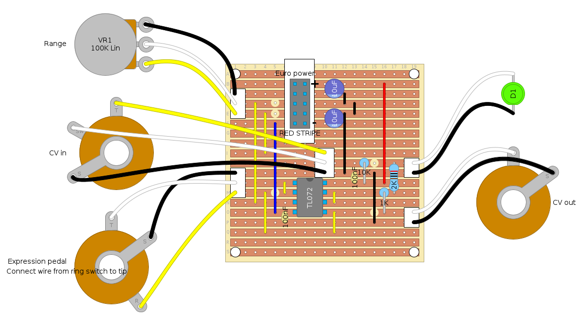

# exped
Expression pedal interface synth module.

Designed for use with an M-Audio EX-P pedal but should be more generally usable with suitable tweaks. With no CV input, pedal controls an output CV varying from 0 to 10V with range pot all the way up. With CV input, pedal controls an attenuated version at output. Use range pot to adjust output range.

With no pedal plugged in, it behaves as if there were a pedal completely down, so range pot gives 0 to 10V voltage source with no CV input, or attenuated CV with CV input.

Files:

*  [expedal/](expedal/)    KiCad project files
*  [exped.diy](exped.diy)  Stripboard layout in diylc format
*  [m-audio-ex-p-1072865.png](m-audio-ex-p-1072865.png)  M-Audio EX-P schematic (source unknown)

For stripboard layout of a dual version (with some different component choices to change maximum output and LED brightness) see [https://lookmumnocomputer.discourse.group/t/prototyping-diy-expression-pedal-interface-for-kosmo/649/41](https://lookmumnocomputer.discourse.group/t/prototyping-diy-expression-pedal-interface-for-kosmo/649/41).

